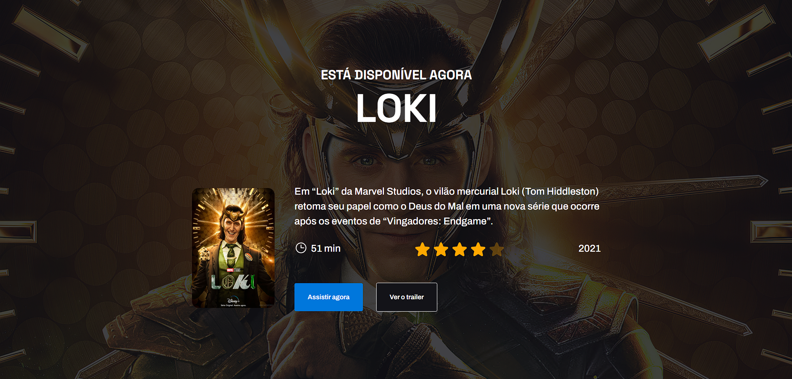
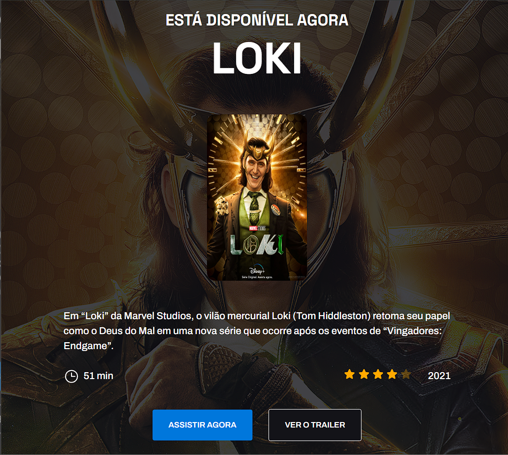
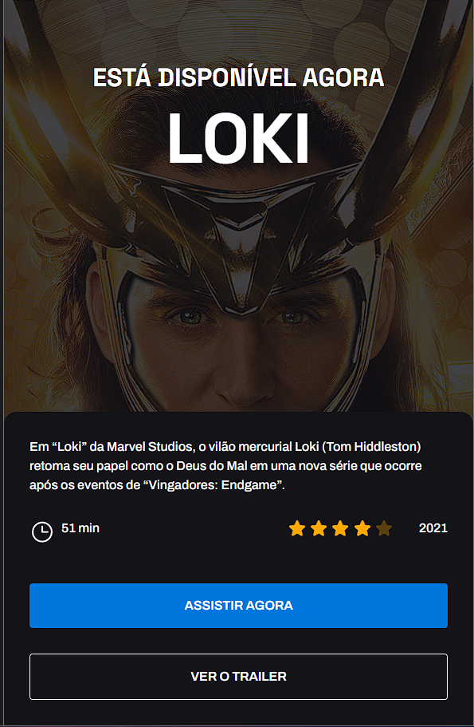

# 🚀 codolandia-loki

## 😎 Demonstração

Veja como o projeto ficou em diferentes dispositivos:

- computador
  

- ipad
  

- telefone

## 🔗 Sobre o projeto

Este projeto é uma página web que mostra as habilidades em HTML e CSS avançado. A página é inspirada no site da Disney+, mas com foco na série Loki, um dos personagens mais populares do universo Marvel. A página é atraente, dinâmica e responsiva, e permite ao usuário assistir ao trailer do filme escolhido. A página pode ser acessada [aqui]().

## 💻 Tecnologias

As tecnologias usadas neste projeto são:

- HTML: a linguagem de marcação que define a estrutura da página.
- CSS: a linguagem de estilo que define a aparência da página.

